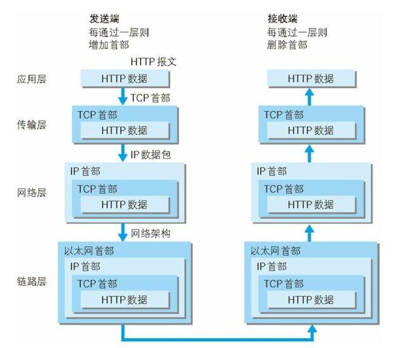
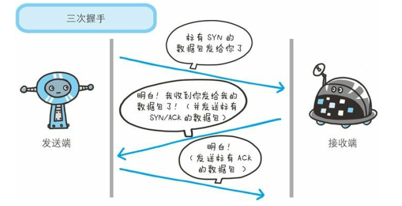

[TOC]

## TCP/IP分层管理

TCP/IP是一个协议族，可以分为四层：应用层、传输层、网络层和数据链路层。通过分层可以对每个层进行单独的管理，不用牵一发而动全身。

**应用层**：决定向用户提供引用服务时通信的活动（比如FTP和DNS还有HTTP协议）

**传输层**：对应用层提供网络连接中的两台计算机之间的数据传输（TCP和UDP）

**网络层**：处理在网络上流动的数据包（网络传输的最小数据单位）

**链路层**：用来处理连接网络的硬件部分

## 计算机之间通过TCP/IP发送HTTP信息的处理流程

发送端每经过一层就打上该层所属的首部信息，接收端每经过一层就消去对应的首部信息。

## IP和IP地址

IP是一种协议，位于网络层，其作用是吧各种数据包传送给对方。因此需要两个重要的条件：IP地址和MAC地址。

* IP地址：指明了节点被分配到的地址
* MAC地址：指网卡所属的固定地址

**注意：**IP地址可变换，MAC地址基本不会更改。

## ARP

是一种用于解析地址的协议，根据通信方的IP地址就可以反查出对应的MAC地址。

## TCP/UDP协议异同

* 两者都位于传输层，负责数据的传输。

* TCP面向连接，而UDP是无连接的。

* TCP提供可靠的字节流传输，即吧大块数据分割成以报文段为单位的数据包进行管理。

* TCP协议为了提供可靠传输，采用三次握手策略。

  

## DNS

域名服务器，位于应用层，通过域名查找IP地址，或者逆向通过IP地址反查域名。

## HTTP协议

HTTP协议是无状态协议，不会保存发送或者响应的报文信息。

### HTTP告知服务器意图的方法

* GET：获取资源

  请求访问已被==URI==识别的资源。

* POST：传输实体主体

  主要用来传输实体的主体，返回的是处理结果。

* PUT：传输文件

  就像FTP协议的文件上传一样，在请求报文的主体中包含文件内容，然后保存到请求URI指定的位置。

* HEAD：获得报文首部

  不返回报文主体部分，用于确认URI的有效性及资源更新的日期时间等。

* DELETE：删除文件

  删除请求URI指定的资源。

## 多部分对象集合

需要在HTTP报文中的首部字段里加上`Content-type`。

并且在后面使用`boundary`字符串来划分多部分对象集合指明的各类实体。

## 获取部分内容

当面对下载途中如果中断，重新请求会耗费很多时间，可以通过范围请求下载未下载的部分，只需要再首部字段加上`Range`。针对范围请求，响应的状态码为==206==。

## 内容协商机制

即web浏览器默认的语言是什么语言，则从服务器请求的资源就是什么语言。

请求报文中的某些首部字段就是判断的基准：

* Accept
* Accept-Charset
* Accept-Encoding
* Accept-Language
* Content-Language

内容协商技术有以下类型：

* 服务器驱动协商

  一切交给服务器端进行，以请求的首部字段作为参考，但对用户来说不一定是最优内容

* 客户端驱动 协商

  由客户端进行内容协商，用户从浏览器上进行手动选择

* 透明协商

  服务器驱动和客户端驱动的结合体，由两者共同协商